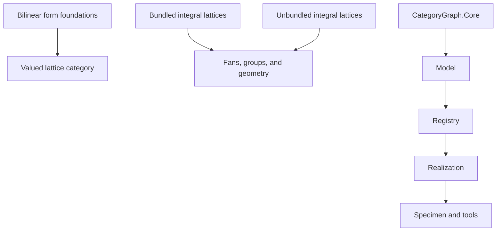

# TODO

## Architecture assessment

The organization is materially messy, but the mess is not uniform.

`CategoryGraph` has a mostly clear dependency order.
`LeanCategories` has several competing mathematical foundations.

### Module dependency graph



### Competing mathematical foundations

The critical problem is duplicate mathematical ownership.

- `LeanCategories/Modules/Bilinear/Objects/Basic.lean` defines the older raw structure `SymmBilinModuleCat`.
- `LeanCategories/Modules/Bilinear/Valued.lean` defines the categorical constructions `BilinModuleCat`, `BilWFormCat`, and `SymBilWFormCat`.
- `LeanCategories/Lattices/Integral/Objects/Basic.lean` defines one bundled `IntegralLattice`.
- `LeanCategories/Lattices/Integral/Unbundled/Basic.lean` defines another `IntegralLattice`.
- `LeanCategories/Lattices/Valued.lean` defines `LatticeCat` as a full subcategory.
- The same file defines integral lattices as `LatticeCat R R`.

`LeanCategories.lean` imports all these systems.
Compilation therefore proves coexistence, not agreement.

Downstream theories select different foundations.
Fans and reflection theory use the older bundled lattice.
Quadratic modules use the unbundled lattice theory.
The new valued theory forms a third branch.

These branches give different owners and meanings to integral lattices, evenness, duals, and discriminants.
No canonical comparison currently joins all three branches.

### Reversed mathematical ownership

Some `Modules` files import specialized `Lattices` files.
The valued `Lattices` theory imports the general bilinear `Modules` theory.

The file import graph has no cycle.
The mathematical ownership graph still points in both directions.

General module and form theory should own the ambient categories.
Lattice theory should use those categories through full subcategories and functors.

### Declarations whose names exceed their definitions

Several declared functors are not honest Lean functors.

`LeanCategories/Modules/Quadratic/Functors/DiscriminantFunctor.lean` defines:

```lean
def DiscriminantFunctor (B : LinearMap.BilinForm R M) : Type _ :=
  IntegralLattice.DiscriminantModule B
```

This declaration is a type-valued function.
It is not a functor between defined categories.

`LeanCategories/Lattices/Integral/Functors/DiscFunctor.lean` declares the discriminant object, map, identity law, and composition law as axioms.

`LeanCategories/Modules/FiniteFreeZ/Functors/ScalarExtension.lean` declares rationalized and realified maps and their functor laws as axioms.

Directory placement and declaration names therefore state more mathematical structure than the definitions provide.

### Conflicting dual and discriminant theories

The older bundled theory treats a quotient of `Hom_Z(L, Z)` by the adjoint image as an intrinsic discriminant group.

The unbundled dual file describes a dual lattice but primarily defines an adjoint map and determinant data.

The valued theory instead separates the module defect from the metric-dual quotient and its value-module form.

These are not interchangeable presentations without comparison theorems and precise hypotheses.
Importing them together leaves the core discriminant object without one canonical owner.

### Axiomatic and shallow branches

The repository contains 45 explicit `axiom` declarations.
It contains no `sorry` or `admit` declarations.

Important axiomatic areas include:

- quadratic forms and polarization for even lattices;
- discriminant objects, maps, and functor laws;
- scalar extension on finite free modules;
- discriminant bilinear and quadratic forms;
- several geometric constructions for schemes, fans, and reflection groups.

Several geometry modules provide shallow records under names of established mathematical categories.
Examples include `KSBAStack`, `LogPair`, and the current cone and fan structures.

These records can compile while leaving their claimed categorical meaning undefined.
The directory tree therefore overstates the semantic integration of those subjects.

### Large mathematical owner files

`LeanCategories/Lattices/Valued.lean` has 1,375 lines.
It contains:

- the lattice full subcategory;
- change-of-value and base-change constructions;
- integral lattices and rationalization;
- scale and value modules;
- quadratic and bilinear `I`-evenness;
- ideal duals;
- metric duals;
- transported dual forms;
- discriminant modules and forms;
- cokernel and exactness results.

`LeanCategories/Modules/Bilinear/Valued.lean` has 639 lines.
It contains:

- the fixed-value bilinear-form category;
- the total varying-value category;
- symmetric full subcategories;
- change-of-value functors;
- zero morphisms;
- quotient forms;
- the general cokernel construction and universal proof.

Each file contains one coherent research direction.
Each file still combines several canonical mathematical constructions with different downstream users.

The split must follow mathematical ownership.
File size alone does not determine the correct split.

### CategoryGraph

`CategoryGraph` is structurally cleaner.
Its main order is:

```text
Core -> Model -> Registry -> Realization -> Specimen -> Tools
```

The model-parametric `AtomicModel` gives the catalogue a useful semantic boundary.
The Mathlib realization remains separate from the expression and registry layers.

Its main visible debt is the parallel expression representation.
`CategoryGraph/Core/Expr.lean` retains `StructuralMapExpr` while migration to indexed `FunctorExpr` continues.

`StructuralMapExpr` still has consumers in normalization, projection, and interpretation.
It is not dead code.
It is an unfinished migration that currently duplicates structural-map syntax.

There are no imports between `CategoryGraph` and `LeanCategories`.
They build as separate libraries.

This separation means the catalogue does not yet normalize the actual categories and functors defined in `LeanCategories`.
Whether that boundary remains abstract or gains a realization layer needs an explicit mathematical decision.

### Workspace boundary

`lean_lattices/` is an untracked nested Git repository.
It is not part of either library in the parent `lakefile.toml`.

Its presence makes the workspace boundary unclear.
Its provenance and intended owner must be identified before any move, deletion, or integration.

### Current evidence

- The full repository build succeeds.
- The repository contains 121 Lean files under `LeanCategories` and `CategoryGraph`.
- Those files have 146 internal import edges.
- The internal import graph has no cycles.
- The two Lean libraries have no cross-library imports.
- The repository contains no `sorry` or `admit` declarations.
- The repository contains 45 explicit `axiom` declarations.
- The root module imports all three lattice foundations.
- `lean_lattices/` is outside the parent build.

These facts establish structural coexistence and compilation.
They do not establish semantic agreement between the competing definitions.

## Required consolidation

### One canonical category chain

- [ ] Select one canonical category for fixed-value bilinear forms.
- [ ] Select one canonical total category when the value module varies.
- [ ] Define symmetric, skew-symmetric, alternating, and quadratic variants through precise predicates or full subcategories.
- [ ] Define the lattice category through its exact finiteness, torsion, and projectivity predicate.
- [ ] Define integral lattices as the `R`-valued case.
- [ ] State exact comparison functors or equivalences for every retained older presentation.
- [ ] Remove obsolete bundled and unbundled foundations after the comparison is decided.

The likely canonical chain is:

```text
BilinModuleCat R W
  -> BilWFormCat R
  -> SymBilWFormCat R
  -> LatticeCat R W
  -> IntegralLatticeCat R
```

This direction remains subject to the exact definitions and comparison theorems.
It must not become canonical merely because the current code compiles.

### Honest functors and predicates

- [ ] Define change-of-value as an honest functor.
- [ ] Define base change as an honest functor on its exact domain.
- [ ] Define rationalization as the functor induced by `R -> Frac(R)`.
- [ ] Define scale and value modules from the exact image constructions.
- [ ] Define quadratic and bilinear `I`-evenness as precise lift predicates.
- [ ] Keep ideal duals distinct from metric duals and ordinary module duals.
- [ ] State every hypothesis needed to transport a formed structure to a dual module.
- [ ] Define the discriminant object as the correct cokernel in the varying-value formed-module category.
- [ ] State its underlying module exact sequence through the relevant forgetful functor.
- [ ] Remove axiomatic functor laws after their definitions and proofs exist.

### Mathematical file ownership

- [ ] Separate fixed-value form categories from the varying-value total category.
- [ ] Separate change-of-value from scalar base change.
- [ ] Give the lattice full subcategory one owner.
- [ ] Give `I`-evenness, scale, and value modules one owner.
- [ ] Give ideal duals one owner.
- [ ] Give metric duals and transported dual forms one owner.
- [ ] Give the discriminant cokernel and exact sequence one owner.

### Catalogue integration

- [ ] Decide the exact realization boundary between `CategoryGraph` and `LeanCategories`.
- [ ] Make catalogue entries denote the canonical categories and functors.
- [ ] Complete migration from `StructuralMapExpr` to indexed `FunctorExpr`.
- [ ] Remove `StructuralMapExpr` after all consumers migrate.

### Workspace ownership

- [ ] Identify the provenance and intended owner of `lean_lattices/`.
- [ ] Decide whether it is a reference clone, an input repository, or intended parent content.
- [ ] Do not change or remove it before that decision.
