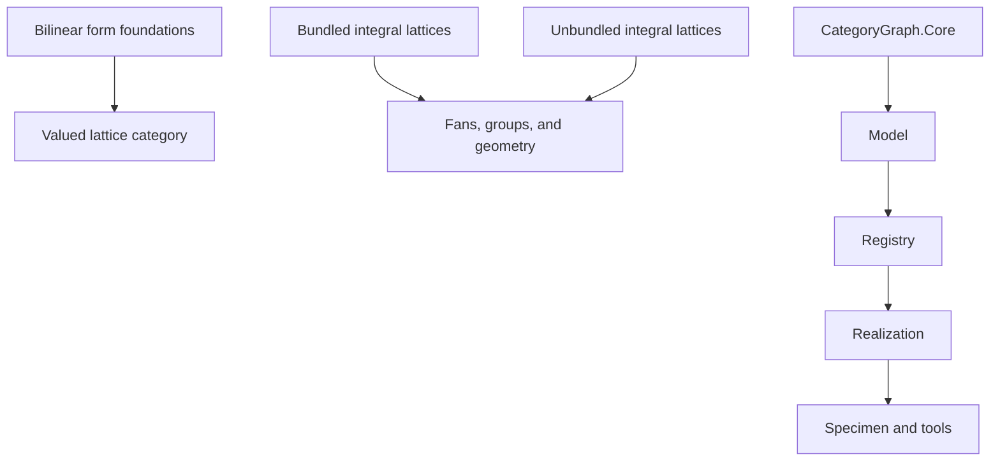

# TODO

## Architecture assessment

The organization is materially messy, but the mess is not uniform.

`CategoryGraph` has a mostly clear dependency order.
`LeanCategories` has several competing mathematical foundations.

### Module dependency graph



### Competing mathematical foundations

The critical problem is duplicate mathematical ownership.

- `LeanCategories/Modules/Bilinear/Objects/Basic.lean` defines the older raw structure `SymmBilinModuleCat`.
- `LeanCategories/Modules/Bilinear/Valued.lean` defines the categorical constructions `BilinModuleCat`, `BilWFormCat`, and `SymBilWFormCat`.
- `LeanCategories/Lattices/Integral/Objects/Basic.lean` defines one bundled `IntegralLattice`.
- `LeanCategories/Lattices/Integral/Unbundled/Basic.lean` defines another `IntegralLattice`.
- `LeanCategories/Lattices/Valued.lean` defines `LatticeCat` as a full subcategory.
- The same file defines integral lattices as `LatticeCat R R`.

`LeanCategories.lean` now imports only the valued spine.
The older systems remain as source files outside the public root.

Downstream theories select different foundations.
Fans and reflection theory use the older bundled lattice.
Quadratic modules use the unbundled lattice theory.
The new valued theory forms a third branch.

These branches give different owners and meanings to integral lattices, evenness, duals, and discriminants.
No canonical comparison currently joins all three branches.

### Reversed mathematical ownership

Some `Modules` files import specialized `Lattices` files.
The valued `Lattices` theory imports the general bilinear `Modules` theory.

The file import graph has no cycle.
The mathematical ownership graph still points in both directions.

General module and form theory should own the ambient categories.
Lattice theory should use those categories through full subcategories and functors.

### Declarations whose names exceed their definitions

The cleanup removed three declarations whose names exceeded their definitions.

- The quadratic `DiscriminantFunctor` was only a type-valued function.
- The integral-lattice discriminant functor used axiomatic maps and laws.
- The finite-free scalar-extension functors used axiomatic maps and laws.

The canonical spine now provides honest base-change and rationalization functors.
The core-restricted discriminant functor remains open.

### Conflicting dual and discriminant theories

The older bundled theory treats a quotient of `Hom_Z(L, Z)` by the adjoint image as an intrinsic discriminant group.

The unbundled dual file describes a dual lattice but primarily defines an adjoint map and determinant data.

The valued theory instead separates the module defect from the metric-dual quotient and its value-module form.

These are not interchangeable presentations without comparison theorems and precise hypotheses.
Importing them together leaves the core discriminant object without one canonical owner.

### Axiomatic and shallow branches

The repository contains 31 explicit `axiom` declarations.
It contains no `sorry` or `admit` declarations.

Important axiomatic areas include:

- quadratic forms and polarization for even lattices;
- discriminant objects, maps, and functor laws;
- discriminant bilinear and quadratic forms;
- several geometric constructions for schemes, fans, and reflection groups.

Several geometry modules provide shallow records under names of established mathematical categories.
Examples include `KSBAStack`, `LogPair`, and the current cone and fan structures.

These records can compile while leaving their claimed categorical meaning undefined.
The directory tree therefore overstates the semantic integration of those subjects.

### Large mathematical owner files

The valued lattice spine now uses these mathematical owners:

- `Basic.lean` owns the lattice full subcategory;
- `ChangeValue.lean` owns postcomposition of values;
- `BaseChange.lean` owns scalar extension;
- `ScaleAndEvenness.lean` owns scale, value, and `I`-evenness;
- `Rationalization.lean` owns the rational span;
- `IdealDual.lean` owns ideal duals;
- `MetricDual.lean` owns transported dual forms; and
- `Discriminant.lean` owns the formed cokernel and exact sequence.

The valued bilinear spine now uses these mathematical owners:

- `Fixed.lean` owns fixed-value forms and their predicates;
- `ChangeValue.lean` owns postcomposition of values;
- `Total.lean` owns the varying-value category;
- `Properties.lean` owns its full subcategories; and
- `Cokernel.lean` owns formed cokernels and their universal proofs.

The two `Valued.lean` files are public import surfaces.

`Modules/Quadratic/Valued/Fixed.lean` owns the general `W`-valued quadratic-module category.

### CategoryGraph

`LeanCategories/CategoryGraph` is structurally cleaner.
Its main order is:

```text
Core -> Model -> Registry -> Realization -> Specimen -> Tools
```

The model-parametric `AtomicModel` gives the catalogue a useful semantic boundary.
The Mathlib realization remains separate from the expression and registry layers.

Its main visible debt is the parallel expression representation.
`LeanCategories/CategoryGraph/Core/Expr.lean` retains `StructuralMapExpr` during the indexed `FunctorExpr` migration.

`StructuralMapExpr` still has consumers in normalization, projection, and interpretation.
It is not dead code.
It is an unfinished migration that currently duplicates structural-map syntax.

The catalogue and mathematical categories now form one `LeanCategories` library tree.
Catalogue rows still need realization proofs for the canonical categories and functors.

### Workspace boundary

The obsolete `lean_lattices/` repository had no commits or remote.
Its only Lean declaration was `hello := "world"`.
The cleanup found no mathematical content to move and sent the template to trash.

### Current evidence

- The full repository build succeeds.
- The repository contains 131 Lean files under `LeanCategories`.
- Those files have 156 internal public-import edges.
- The internal import graph has no cycles.
- One Lean library owns the catalogue and mathematical categories.
- The repository contains no `sorry` or `admit` declarations.
- The repository contains 31 explicit `axiom` declarations.
- The root module imports the catalogue and canonical valued foundations.
- The obsolete `lean_lattices/` template is no longer in the workspace.

These facts establish structural coexistence and compilation.
They do not establish semantic agreement between the competing definitions.

## Required consolidation

### One canonical category chain

- [x] Select one canonical category for fixed-value bilinear forms.
- [x] Select one canonical total category when the value module varies.
- [x] Define symmetric, skew-symmetric, alternating, and quadratic variants through precise predicates or full subcategories.
- [x] Define lattices as projective modules with symmetric forms, without a finite-rank condition.
- [x] Define integral lattices as the `R`-valued case.
- [ ] State exact comparison functors or equivalences for every retained older presentation.
- [ ] Remove obsolete bundled and unbundled foundations after the comparison is decided.

The likely canonical chain is:

```text
BilinModuleCat R W
  -> BilWFormCat R
  -> SymBilWFormCat R
  -> LatticeCat R W
  -> IntegralLatticeCat R
```

This direction remains subject to the exact definitions and comparison theorems.
It must not become canonical merely because the current code compiles.

### Honest functors and predicates

- [x] Define change-of-value as an honest functor.
- [x] Define base change as an honest functor on its exact domain.
- [x] Define rationalization as the functor induced by `R -> Frac(R)`.
- [x] Define scale and value modules from the exact image constructions.
- [x] Define quadratic and bilinear `I`-evenness as precise lift predicates.
- [x] Keep ideal duals distinct from metric duals and ordinary module duals.
- [ ] State every hypothesis needed to transport a formed structure to a dual module.
- [x] Define the discriminant object as the correct cokernel in the varying-value formed-module category.
- [ ] State its underlying module exact sequence through the relevant forgetful functor.
- [ ] Remove axiomatic functor laws after their definitions and proofs exist.

### Mathematical file ownership

- [x] Separate fixed-value form categories from the varying-value total category.
- [x] Separate change-of-value from scalar base change.
- [x] Give the lattice full subcategory one owner.
- [x] Give `I`-evenness, scale, and value modules one owner.
- [x] Give ideal duals one owner.
- [x] Give metric duals and transported dual forms one owner.
- [x] Give the discriminant cokernel and exact sequence one owner.

### Catalogue integration

- [x] Merge `CategoryGraph` and the mathematical categories into one `LeanCategories` tree.
- [ ] Make catalogue entries denote the canonical categories and functors.
- [ ] Complete migration from `StructuralMapExpr` to indexed `FunctorExpr`.
- [ ] Remove `StructuralMapExpr` after all consumers migrate.

### Workspace ownership

- [x] Inspect `lean_lattices/` for mathematical content.
- [x] Confirm that it contains only a new-project template.
- [x] Remove the obsolete template after scavenging it.
